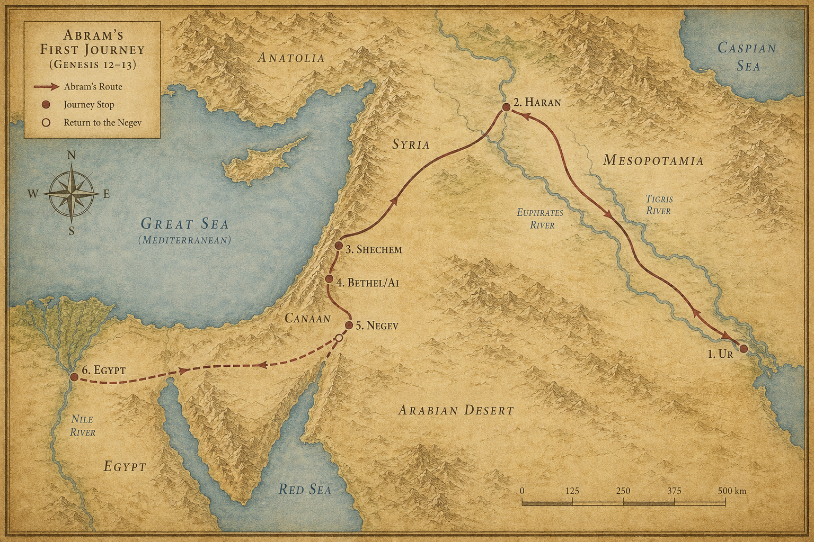

# 창세기 12장 — 떠나라, 내가 보여줄 땅으로

<!-- MAP:genesis-map-12 -->

  
  
지도 5. 창세기 12~13장 배경: 아브람의 첫 여정(우르~하란~가나안~애굽).

<!-- /MAP:genesis-map-12 -->

### 명령

**¹** 여호와께서 아브람에게 말씀하셨다. "네 태어난 땅, 친척, 아버지의 집을 떠나, 내가 네게 보여줄 땅으로 가라."

목적지를 먼저 알려주지 않는 명령이었다. '보여줄 땅' — 가봐야 안다.

**²** 그리고 약속이 이어졌다. "내가 너를 큰 민족으로 만들겠다. 네게 복을 주고, 네 이름을 크게 하겠다. 너는 복을 주는 사람이 될 것이다."

**³** "너를 축복하는 자를 내가 축복하고, 너를 저주하는 자를 내가 저주하겠다. 땅의 모든 민족이 너로 말미암아 복을 받을 것이다."

여섯 개의 약속이 한꺼번에 쏟아졌다. 민족, 복, 이름, 복의 근원, 보호, 그리고 열방의 복. 아브람의 나이 **75세**였다.

> *고고학적 한계 — 아브라함·이삭·야곱 개인의 존재를 직접 증명하는 비문이나 기록은 아직 발견되지 않았다. 동시대 이집트·메소포타미아 문서에 그들의 이름이 등장하지 않는 것은 이상한 일이 아니다 — 그들은 권력자나 도시 지배층이 아닌 가족 단위 유목민이었고, 당시 그런 사람들의 이름은 거의 기록되지 않았다. 다만 그들의 이야기를 둘러싼 세부 — 결혼 관습, 매장 절차, 상속, 노예 거래, 계약 양식, 이름의 어형 — 이 청동기 중기(BC 2000~1500) ANE(고대 근동) 자료들과 정확히 들어맞는다는 점은 학계가 거듭 확인했다(마리, 누지, 알라라크 점토판). 인물의 직접 기록은 없지만, 시대 배경의 직조는 정교하게 그 시대의 것이라는 평가다.*

---

### 출발

**⁴** 아브람은 여호와의 말씀대로 떠났다. 롯도 함께했다.

**⁵** 아브람은 아내 사래와 조카 롯을 데리고, 하란에서 모은 모든 소유와 얻은 사람들을 이끌고 **가나안(Canaan)** — 지금의 이스라엘·팔레스타인·레바논 땅 — 을 향해 출발했다. 그리고 가나안에 이르렀다.

**⁶** 아브람은 그 땅을 지나 **세겜(Shechem · [천] 스켐)** — 현대 팔레스타인 나블루스 — 의 **모레(Moreh) 상수리나무** 있는 곳까지 왔다.

> *그때 가나안에는 이미 사람들이 살고 있었다. 가나안 사람들이었다.*

**⁷** 여호와께서 아브람에게 나타나 말씀하셨다. "내가 이 땅을 네 자손에게 주겠다."

아브람은 자신에게 나타나신 여호와를 위해 그곳에 **제단**을 쌓았다.

---

### 가나안을 가로지르다

**⁸** 거기서 아브람은 더 이동했다. **벧엘(Bethel · [천] 베텔)** — 예루살렘 북쪽 약 19km, 오늘날 베이틴 — 동쪽 산지로 옮겨, 벧엘은 서쪽에, **아이(Ai)** — 벧엘 바로 동쪽 — 는 동쪽에 두고 천막을 쳤다.

거기서도 여호와를 위해 제단을 쌓고, 여호와의 이름을 불렀다.

**⁹** 아브람은 계속 이동하여 **네게브(Negev)** — 이스라엘 남부 사막 지대 — 로 향했다.

---

### 이집트로

**¹⁰** 그 땅에 기근이 들었다. 심각했다. 아브람은 **이집트(애굽)** 로 내려가 잠시 머물기로 했다.

> *학자들은 아브라함의 활동 시기를 대략 BC 2000년 무렵으로 본다. 그 무렵 이집트는 **중왕국 시대(12왕조)**, 강력한 파라오들이 다스리던 전성기였다. 아브람이 만난 파라오는 **아메넴헤트 1세** 또는 그의 후계자였을 가능성이 거론된다. 다만 성경은 그 이름을 남기지 않았다.*

**¹¹** 이집트 국경이 가까워질 때, 아브람이 아내 사래에게 말했다. "당신이 아름다운 여인인 것을 나는 안다."

**¹²** "이집트 사람들이 당신을 보면 '이 여자는 저 남자의 아내'라 하고는, 나는 죽이고 당신은 살려둘 것이다."

**¹³** "제발 내 누이라고 말해 달라. 그러면 당신 덕분에 내가 살겠고 나도 잘 될 것이다."

> *두려움이 만든 계획이었다. 거짓말이지만 반쪽짜리 진실이기도 했다 — 사래는 실제로 아브람의 이복 누이였다. 그러나 아내라는 사실은 숨겼다.*

**¹⁴** 아브람이 이집트에 들어섰다. 이집트 사람들이 사래를 보았다. 아주 아름다웠다.

**¹⁵** 파라오(바로)의 신하들도 그녀를 보고 파라오에게 칭찬했다. 사래는 파라오의 궁으로 불려들어갔다.

**¹⁶** 아브람은 그녀 덕분에 좋은 대우를 받았다. 파라오에게서 양과 소와 수나귀와 남녀 종들, 암나귀와 낙타들을 받았다.

---

### 발각

**¹⁷** 그런데 여호와께서 사래 때문에 파라오와 그 집에 큰 재앙을 내리셨다.

**¹⁸** 파라오가 아브람을 불렀다. "당신이 내게 왜 이런 일을 했소? 어째서 그녀가 당신 아내라는 것을 내게 말하지 않았소?"

**¹⁹** "왜 '내 누이'라고 해서 내가 아내로 삼게 만들었소? 자, 당신 아내를 데리고 가시오."

**²⁰** 파라오가 신하들에게 명령했다. 아브람과 그의 아내, 그리고 그가 가진 모든 것을 함께 내보내라고.

> *쫓겨났다. 이집트 최강 권력자에게 거짓이 들통나 추방당했다. 그러나 아브람의 소유는 오히려 더 늘어 있었다.*

---

> *다음 장 — 이집트에서 돌아온 아브람과 롯. 땅이 두 사람을 감당하지 못하게 된다.*
