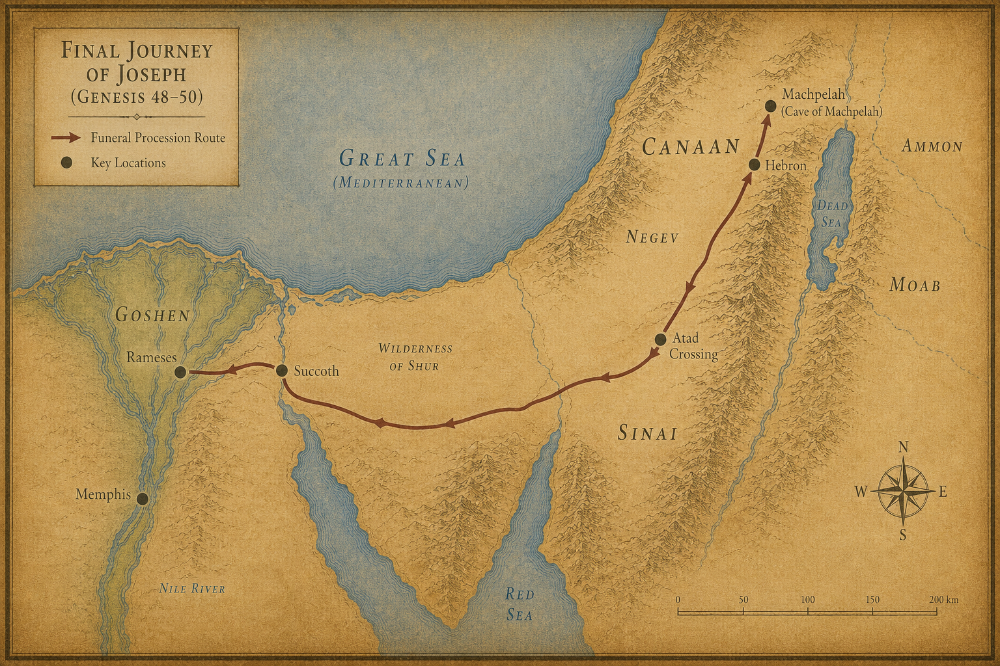

# 창세기 50장 — 창세기의 마지막 장

<!-- MAP:genesis-map-50 -->

  
  
지도 13. 창세기 48~50장 배경: 야곱 장례 행렬(애굽~막벨라).

<!-- /MAP:genesis-map-50 -->

### 아버지의 얼굴에 엎드려

**¹** 요셉이 아버지의 얼굴에 엎드렸다. 울었다. 입을 맞추었다.

**²** 요셉이 자기 신하 의원들에게 명하여 아버지의 몸에 썩지 않게 하는 향료를 바르게 했다. 의원들이 이스라엘에게 향을 입혔다.

**³** 사십 일이 걸렸다. 향을 입히는 데 드는 기간이었다. 이집트 사람들은 칠십 일 동안 야곱을 위해 슬피 울었다.

> *이방 나라가 히브리 족장의 죽음을 애도했다. 요셉이 이집트에서 쌓은 세월의 무게였다.*

---

### 가나안으로 돌아가는 장례 행렬

**⁴** 통곡의 날이 지나자 요셉이 파라오의 궁 신하들에게 아뢰었다. "내가 파라오의 은혜를 입었다면 부탁드립니다. 파라오에게 전해 주십시오."

**⁵** "아버지께서 돌아가시기 전에 내게 맹세하게 하시며 말씀하셨습니다. '내가 가나안 땅에 파두었던 묘지에 장례를 치러라'고. 부탁이오니 내가 올라가 아버지를 장사하고 돌아오게 해주십시오."

**⁶** 파라오가 답했다. "올라가서 네 아버지를 맹세대로 장례를 치러라."

**⁷** 요셉이 올라갔다. 파라오의 모든 신하, 파라오 궁의 지도자들과 이집트 땅의 지도자들이 함께했다.

**⁸** 요셉의 집안과 형제들과 아버지의 집안도 함께했다. 고센 땅에 남은 건 어린아이들과 양 떼와 소 떼뿐이었다.

**⁹** 병거와 기병이 따라갔다. 큰 대부대였다.

**¹⁰** 그들이 요단강 건너편 아닷(Atad) 타작마당에 이르렀다. 거기서 크게 통곡하며 슬피 울었다. 요셉이 아버지를 위해 칠 일 동안 슬피 울었다.

**¹¹** 그 땅 가나안 사람들이 아닷 타작마당의 통곡을 보고 말했다. "이것은 이집트 사람들의 큰 슬픔이로다."

그래서 그 곳 이름을 **아벨미스라임(Abel Mizraim, 요단강 근처)** 이라 불렀다. '이집트인들의 슬픔'이라는 뜻이었다.

**¹²** 야곱의 아들들이 아버지의 명대로 했다.

**¹³** 그들이 야곱을 가나안 땅으로 메어다가 마므레 앞 막벨라(Machpelah, 헤브론) 밭 굴에 장례를 치렀다. 아브라함이 헷 족속 에브론에게서 묘지로 사들인 바로 그 굴이었다.

---

### 형제들의 두려움

**¹⁴** 장례를 마치고 요셉이 이집트로 돌아왔다. 형제들과 함께 올라갔던 모든 사람이 함께 돌아왔다.

**¹⁵** 그런데 형제들 사이에 불안이 피어올랐다.

> *'아버지가 살아 계실 때는 괜찮았다. 그런데 이제 아버지가 돌아가셨다. 요셉이 우리를 미워하여 우리가 그에게 행한 모든 악을 갚으면 어쩌지?'*

**¹⁶** 형제들이 요셉에게 전갈을 보냈다. "아버지께서 돌아가시기 전에 명하셨습니다."

**¹⁷** "'너희는 요셉에게 이렇게 말하라. 네 형들이 네게 악을 행하였으나 이제 그 허물과 죄를 용서하라'고 하셨습니다. 우리는 주의 종들입니다. 부탁드립니다. 아버지의 하나님을 섬기는 종들의 죄를 용서해 주십시오."

> *실제로 야곱이 그런 말을 남겼는지는 본문에 없다. 형제들이 두려움에 꾸며낸 것이었을 수도 있다. 어쨌든 그들은 아직도 22년 전 그 날을 놓지 못하고 있었다.*

**¹⁸** 형제들이 직접 요셉 앞에 와서 엎드렸다. "우리가 주의 종입니다."

---

### 두려워하지 마라

**¹⁹** 요셉이 그들을 바라보았다. 눈에 눈물이 맺혔다. "두려워하지 마십시오. 내가 하나님을 대신할 수 있겠습니까?"

**²⁰** "너희는 나를 해치려 했지만, 하나님은 그것을 선으로 바꾸셨다. 오늘처럼 많은 사람의 목숨을 살리시려는 뜻이었다."

**²¹** "이제 두려워하지 마라. 내가 너희와 너희 자녀를 먹여 살리겠다."

요셉이 형들을 위로하며 다정하게 말했다.

> *22년 전의 구덩이, 은 이십에 팔리던 그 날, 이집트의 감옥 — 그 모든 것이 이 한마디로 녹아내렸다. 하나님이 그 모든 고통을 선으로 바꾸셨다는 고백이었다.*

---

### 요셉의 마지막 날들

**²²** 요셉은 아버지 집안과 함께 이집트에 살았다. 요셉이 백십 세를 살았다.

**²³** 요셉은 에브라임의 3대 자손까지 보았다. 므낫세의 아들 마길의 자녀들도 요셉의 무릎에서 태어났다.

**²⁴** 요셉이 형제들에게 말했다. "나는 곧 죽는다. 그러나 하나님이 너희를 반드시 찾아오신다. 이 땅에서 너희를 이끌어 내어, 아브라함과 이삭과 야곱에게 약속하신 그 땅으로 데려가실 것이다."

**²⁵** 요셉이 이스라엘 자손에게 맹세를 받았다. "하나님이 반드시 너희를 찾아오신다. 그때, 내 뼈를 여기서 메고 올라가라."

> *요셉은 이집트의 총리였다. 파라오의 두 번째 사람이었다. 그러나 마지막 소원은 약속의 땅에 묻히는 것이었다. 그 뼈가 어디에 속하는지 그는 알고 있었다.*

**²⁶** 요셉이 백십 세에 죽었다. 썩지 않게 하는 향료를 입혔다. 이집트에서 입관했다.

> *요셉이 죽고 약 400년 후 출애굽이 일어난다. 출애굽기에서 모세를 박해하는 새 파라오는 보통 **람세스 2세(BC 1279~1213)** 또는 그 직전 세티 1세로 추정된다. 그 사이 이집트에서는 힉소스가 쫓겨나고 신왕국(18·19왕조)이 들어섰으며, "요셉을 알지 못하는 새 왕"(출 1:8)이 등장한다.*

---

> *그렇게 창세기의 막이 내린다.*

> *하늘과 땅의 창조로 시작한 이 책이, 이집트의 관 하나로 끝난다. 그러나 그것은 끝이 아니었다. 요셉의 뼈는 이집트에 누워 있었지만, 그 뼈는 기다리고 있었다. 약속이 이루어질 날을.*

> *400년 후, 한 민족이 노예로 신음할 것이다. 그리고 하나님이 다시 움직이실 것이다. 요셉의 해골은 광야 40년을 함께 건너 약속의 땅 세겜(Shechem, 팔레스타인 나블루스)에 묻히게 된다. 창세기가 뿌린 씨앗이 출애굽기에서 싹을 틔울 것이다.*

---

> *400년 후 — 한 아이가 나일 강 갈대 상자 속에 떠내려간다. 그의 이름은 모세다. 그러나 그 이야기는 다음 책(출애굽기)의 몫이다.*
